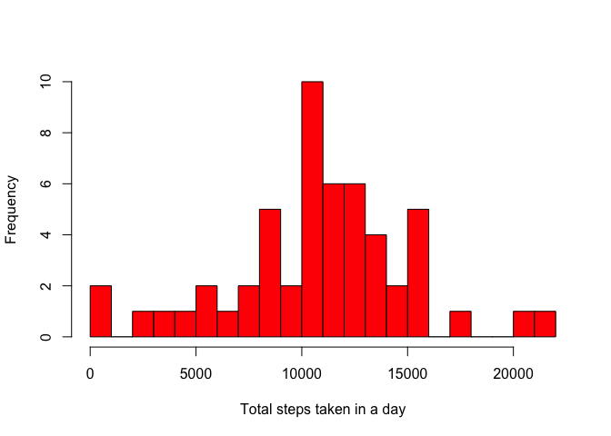
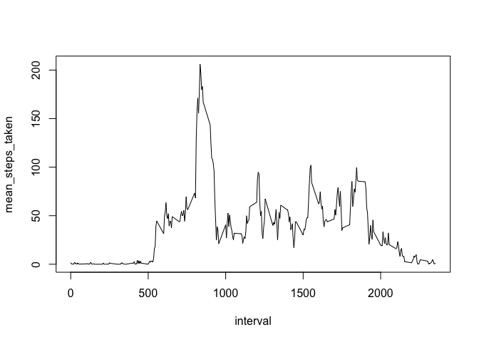
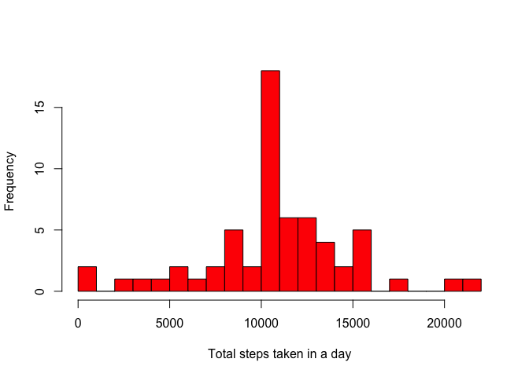
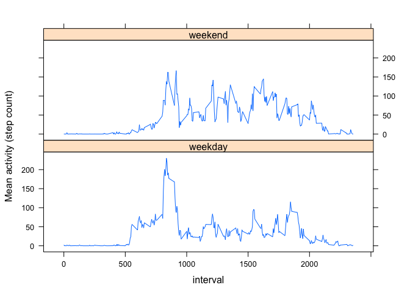

# Reproducible Research: Peer Assessment 1

## Loading and preprocessing the data
In order to analyse the activity monitoring data we must first load the dataset.
In order to do this we must create a connection to the zip file containing
the data:

```r
connection<- unzip("activity.zip")
```

The data can be read in using the data.table package.

```r
library(data.table)
amd<- fread(connection)
```

We shall convert the date into the POSIXct format for convenience:

```r
# Convert date values 
amd[, date := as.POSIXct(date,format = "%Y-%m-%d")]
```

## What is mean total number of steps taken per day?
The total number of steps (excluding missing values) taken each day during the 
two months can be described with a histogram:

```r
total_steps_per_day<- amd[!is.na(steps),sum(steps) ,by=date]
total_steps_per_day[,hist(V1,
                          breaks = 30,
                          col="red",
                          main = "",
                          xlab = "Total steps taken in a day")]
```

 

A summary of the the total number of steps (excluding missing values) over all
the days shows the mean number of steps in a day to be
10770 and the median to be 10760:

```r
summary(total_steps_per_day[,V1])
```

```
##    Min. 1st Qu.  Median    Mean 3rd Qu.    Max. 
##      41    8841   10760   10770   13290   21190
```
## What is the average daily activity pattern?
The average daily activity pattern (excluding missing values) can be seen in the
graph below where interval values range from 0-2400:


```r
steps_by_interval<- amd[!is.na(steps),mean(steps),by=interval]
setnames(steps_by_interval,"V1","mean_steps_taken")
steps_by_interval[,plot(interval,mean_steps_taken, type = "l")]
```

 

The interval during which the maximum average steps are taken starts at 8:35 a.m. 


```r
steps_by_interval[which.max(mean_steps_taken)]
```

```
##    interval mean_steps_taken
## 1:      835         206.1698
```
## Imputing missing values
No missing values occur for either the date or interval labels:

```r
amd[is.na(date),sum(.N)]
```

```
## [1] 0
```

```r
amd[is.na(interval),sum(.N)]
```

```
## [1] 0
```
The total number of missing values for the recorded steps is:

```r
amd[is.na(steps),sum(.N)]
```

```
## [1] 2304
```
The values will be imputed to reduce the bias introduced by omitting these
values. For each interval that was not reported, the average activity over that
interval is instead used:

```r
#Generate the mean for each interval
amd[,mean_steps := as.integer(mean(na.omit(steps))),by= interval]
```

```
##        steps       date interval mean_steps
##     1:    NA 2012-10-01        0          1
##     2:    NA 2012-10-01        5          0
##     3:    NA 2012-10-01       10          0
##     4:    NA 2012-10-01       15          0
##     5:    NA 2012-10-01       20          0
##    ---                                     
## 17564:    NA 2012-11-30     2335          4
## 17565:    NA 2012-11-30     2340          3
## 17566:    NA 2012-11-30     2345          0
## 17567:    NA 2012-11-30     2350          0
## 17568:    NA 2012-11-30     2355          1
```

```r
# Created a new column for the new data with imputed values
amd[,imputed_steps:=steps]
```

```
##        steps       date interval mean_steps imputed_steps
##     1:    NA 2012-10-01        0          1            NA
##     2:    NA 2012-10-01        5          0            NA
##     3:    NA 2012-10-01       10          0            NA
##     4:    NA 2012-10-01       15          0            NA
##     5:    NA 2012-10-01       20          0            NA
##    ---                                                   
## 17564:    NA 2012-11-30     2335          4            NA
## 17565:    NA 2012-11-30     2340          3            NA
## 17566:    NA 2012-11-30     2345          0            NA
## 17567:    NA 2012-11-30     2350          0            NA
## 17568:    NA 2012-11-30     2355          1            NA
```

```r
# Assign an intervals mean value in all cases of missing data
amd[is.na(imputed_steps),imputed_steps:= as.integer(round(mean_steps))]
```

```
##        steps       date interval mean_steps imputed_steps
##     1:    NA 2012-10-01        0          1             1
##     2:    NA 2012-10-01        5          0             0
##     3:    NA 2012-10-01       10          0             0
##     4:    NA 2012-10-01       15          0             0
##     5:    NA 2012-10-01       20          0             0
##    ---                                                   
## 17564:    NA 2012-11-30     2335          4             4
## 17565:    NA 2012-11-30     2340          3             3
## 17566:    NA 2012-11-30     2345          0             0
## 17567:    NA 2012-11-30     2350          0             0
## 17568:    NA 2012-11-30     2355          1             1
```

In order to assess the effect of imputing the previous analysis is carried out
once more:
The total number of steps taken each day during the 
two months can be described with a histogram:

```r
total_steps_per_day<- amd[!is.na(imputed_steps),sum(imputed_steps) ,by=date]
total_steps_per_day[,hist(V1,
                          breaks = 30,
                          col="red",
                          main = "",
                          xlab = "Total steps taken in a day")]
```

 

A summary of the the total number of steps over all
the days shows the mean number of steps in a day to be
10750 and the median to be 10640:

```r
summary(total_steps_per_day[,V1])
```

```
##    Min. 1st Qu.  Median    Mean 3rd Qu.    Max. 
##      41    9819   10640   10750   12810   21190
```
These results are similar to before with the exception of the substantial and 
artificial increase in one bin of the histogram. Imputing missing values using
this method is not ideal.


## Are there differences in activity patterns between weekdays and weekends?
During the weekdays activity in the morning is starts earlier, persists for a
longer duration and is more intense than on the weekends. At weekends, however, activity
levels of activity are maintained more consistently over the full course of the day:

```r
amd[,weekend_status := "weekday"]
amd[weekdays(date) %in% c("Saturday","Sunday"), weekend_status := "weekend"]
comparison_of_days<- amd[,mean(imputed_steps) ,by = .(interval, weekend_status)]
library(lattice)
comparison_of_days[,xyplot(V1 ~ interval | weekend_status,
                           type = "l" , 
                           ylab = "Mean activity (step count)",
                           layout = c(1,2))]
```

 
